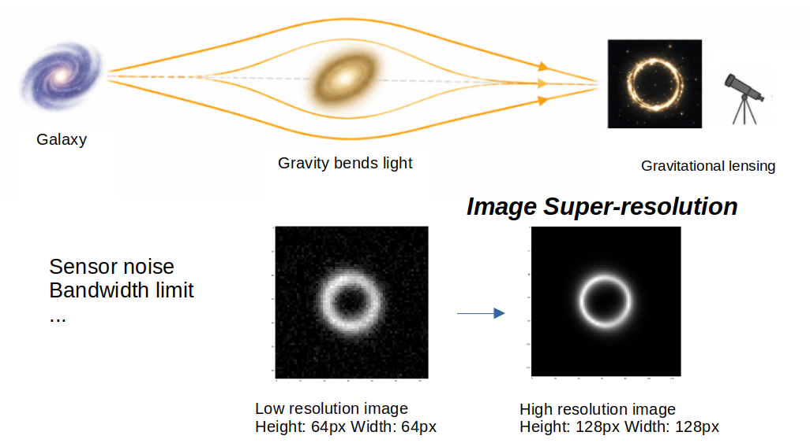

# Strong Lensing Super-Resolution

A small [DeepLearn 2026](https://deeplearn.irdta.eu/2026/) Summer School [hackathon](https://github.com/ML4SCI/DeepLearnHackathon/tree/main/GravitationalLensingChallenge)
project for reconstructing 128 x 128 gravitational-lensing images from
64 x 64 inputs.



## What is here

- `data_preperation.ipynb` prepares and previews the challenge data.
- `superres.py` contains the dataset loader, training loop, evaluation, and visualisation code.
- `ckpt/baseline/` contains the baseline checkpoint.
- `ckpt/sr-resnet/` contains the residual-network checkpoint.

The models are PyTorch CNNs that upscale by 2 using pixel shuffle. The
baseline is a compact SRCNN-style model; the stronger model adds 16
residual blocks and a global skip connection. Training uses a masked
pixel loss so that the relevant image structure contributes more strongly
to the objective. Results are compared with MSE, L1, SSIM, and PSNR.

## Running the experiment

Install the Python dependencies in a PyTorch environment:

```bash
pip install numpy matplotlib scikit-image torch tqdm
```

Prepare the challenge data with `data_preperation.ipynb`, then update the
dataset paths near the top of `superres.py`. The script currently expects
the following layout:

```text
dataset_superres/
	train/{LR,HR}/
	val/{LR,HR}/
```

Run the full training and evaluation script with:

```bash
python superres.py
```

The script saves the best weights as `super_resolution_model_best.pt` and
produces `eval.png` and `vis.png` after training. Existing checkpoints are
available in `ckpt/` for inspection without retraining.

## Result

&#127866; **2nd place** in the Strong Lensing Challenge.

[View the certificate](./misc/hackathon%20certificate%20DeepLearn%202026%20-%20Ruijie%20Ren.pdf)